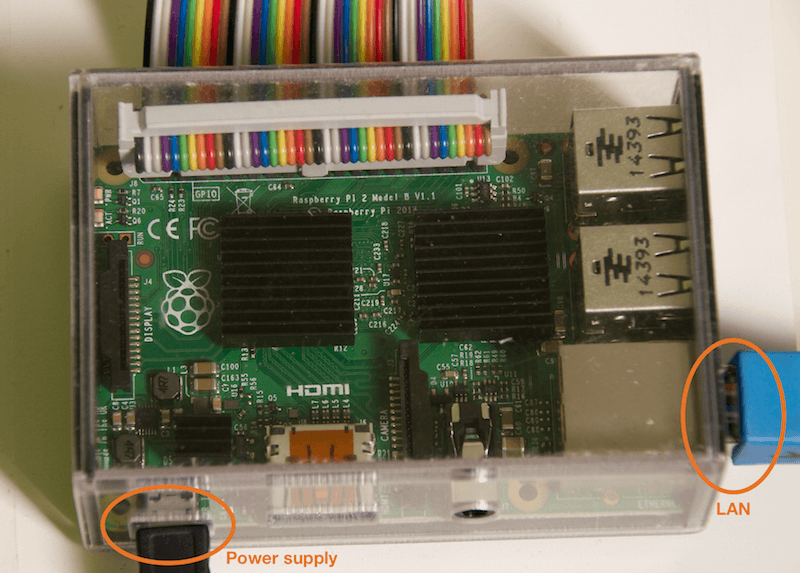
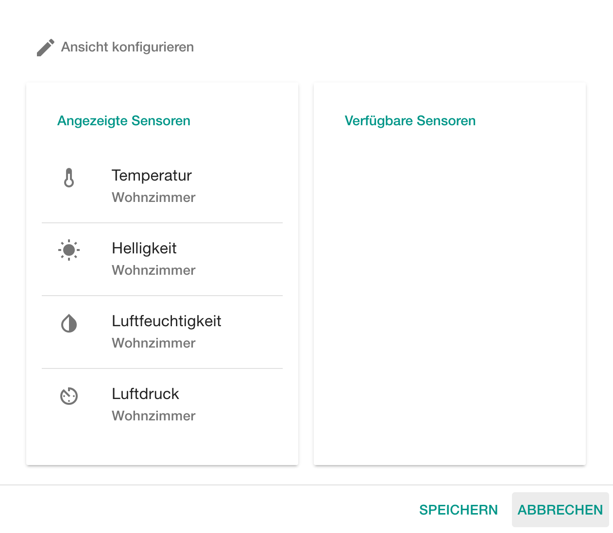
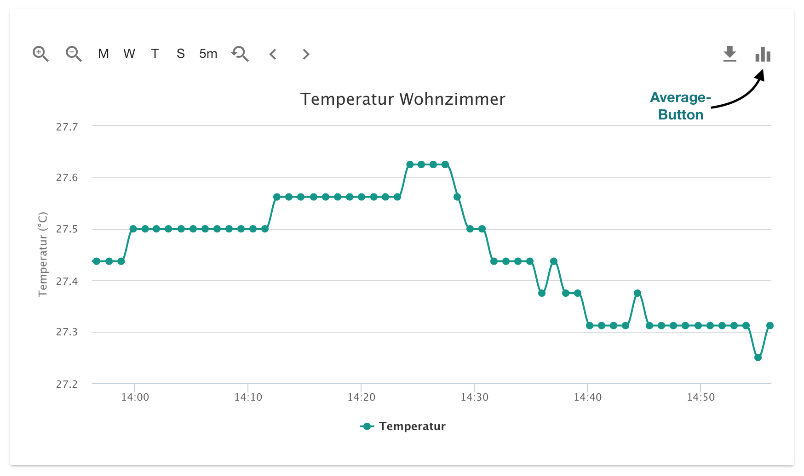
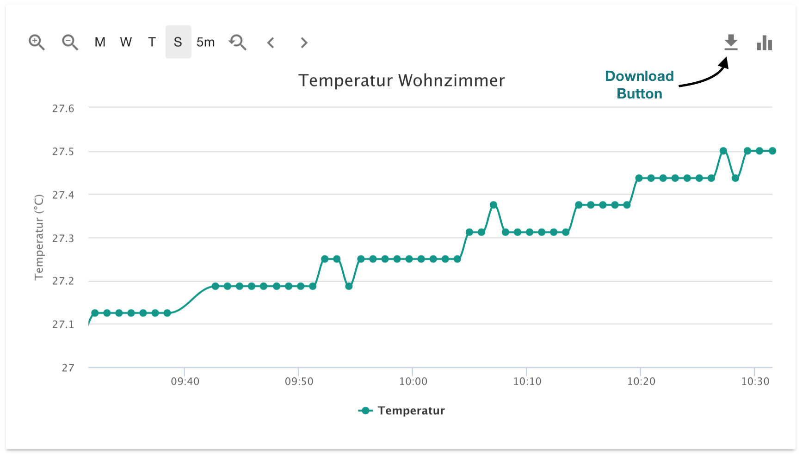

# User Guide

## Set up your Raspberry Pi

* At first connect the Raspberry Pi with an ethernet cable to get access to the LAN or the internet. The network adapter of your Raspberry Pi is already pre-configured and you don't have to do anything special.
* Connect the Raspberry Pi with the included power supply to a power outlet.

Now the Raspberry Pi boots up automatically.
If you have already paired your Raspberry Pi with your user account the metering unit starts its work (meter and send) immediately after booting.

## Pair your Raspberry Pi

* Browse to http://loggr.stkn.org/.
* If you don't have an existing account, please create a new one ("Registrieren"). Otherwise login to your account with your credentials.
* Click on the pairing button and insert the IP of the Raspberry Pi. You can find out the IP of the Raspberry Pi from your router dhcp menu. For example the Raspberry Pi uses IP 192.168.178.35 in a local area network (LAN).

* Click on "PAIREN".

Now the Raspberry Pi is configured and paired with your user account.

## Use loggr.io

### Change graphs visibility and order

Click on "Ansicht konfigurieren". In the left list there are the shown graphs. This list should be empty on first start. On the right side you can find available sensors which can be shown as graphs in the app. Now you can drag and drop sensors from the right to the left. Sensors which are listed on the left list will be shown after clicking on "Speichern". To remove sensors from the "Angezeigte Sensoren" list just have to click on the "X" symbol which appears when hovering over a sensor.

### View meterings

The meterings are shown in the standard view as line graphs.
You can zoom in and out, left and right. You can also view the meterings of the last 5 minutes (5m), last hour (S), week (W), month (M).

### Show average values

If you want to see the average values of meterings you can click on the average button in the right upper corner of the graph card. The graph morphs in a new graph which shows the daily average values of the current sensor.

For getting the standard view back click on the standard-view-button in the right upper corner.

### Print your graphs

For printing your graphs, click on the download button in the right upper corner of the graph card.

By clicking a new menu drops down. You can choose between "Drucken" and export in several formats.

### Change your password

In the user menu you can see your account details, change your Name, email or your password. To get there, click on the user-symbol.

And then click on "Benutzerdaten" to get to the user menu.

For example to change your name click on your name and write your new name in there. Afterwards click on "Speichern" to save your changes.

### Logout

Click also on the user menu button and then click on "Logout". Your Raspberry will meter for you while you are logged out.

### Impressum and About

The Impressum and About are in the right upper corner. Just click ont the "..." to get them.
