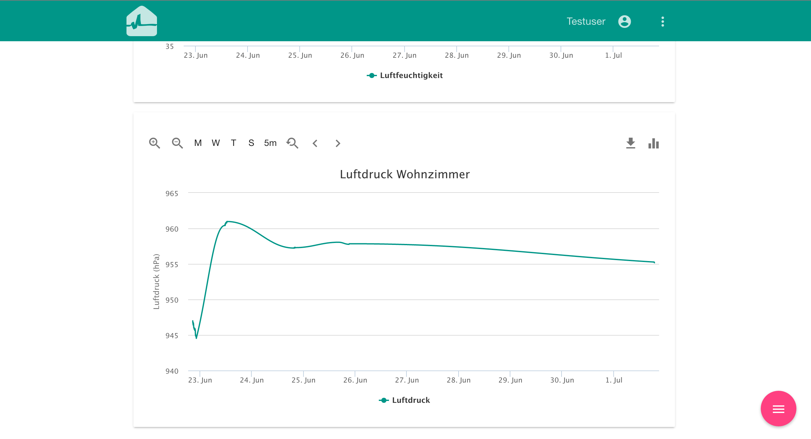
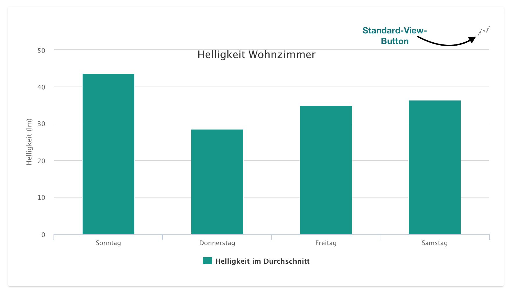

# User Guide for loggr.io

## Build up your Raspberry Pi

* First connect the Raspberry Pi with an Ethernet cable.

* Connect the Raspberry Pi with the included power supply with a power outlet.

Now the Raspberry starts automatically.

## Pair your Raspberry

* Browse to http://loggr.stkn.org/.
* If you don't have an account already, make a new one, else login to your account.
*  Click on the pairing-button and insert the IP from the Raspberry Pi. You can check the IP from the Raspberry Pi in your router menu. For example the Raspberry Pi has the IP 192.168.178.35.

* Click on "PAIREN".

Now the Raspberry Pi is configurated and paired with your User Account.

## Use loggr.io

### Decide which graphs you want to see

Click on "Ansicht konfigurieren" and order the graphs per drag and drop. In the left list are the shown graphs and in the right list are the graphs which are available.

### Insight the meterings

The meterings are shown in the standard view. The picture shows the standard view.

### Show the average

If you want to see the average of the meterings you can click on the average-button in the right upper corner in the graph. The graph turns in a new graph.

For getting the standard view back click on the standard-view-button in the right upper corner.

